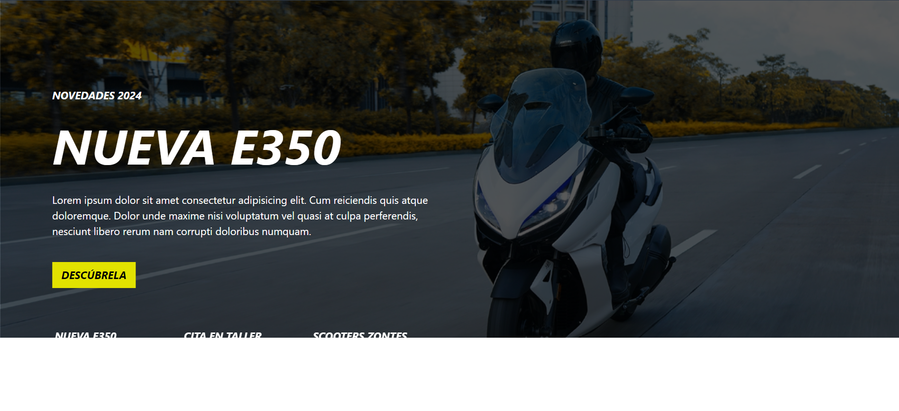
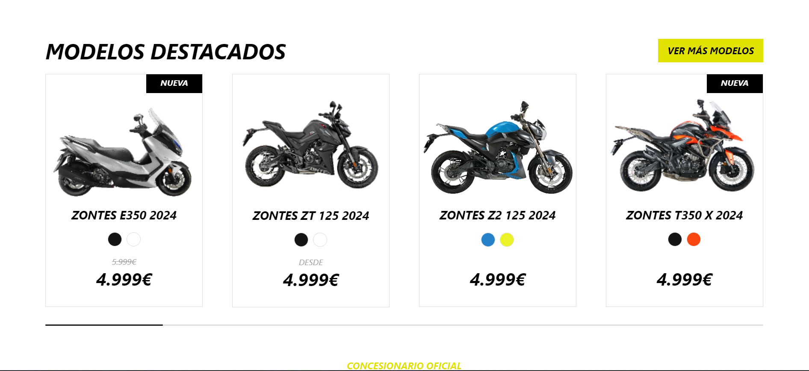
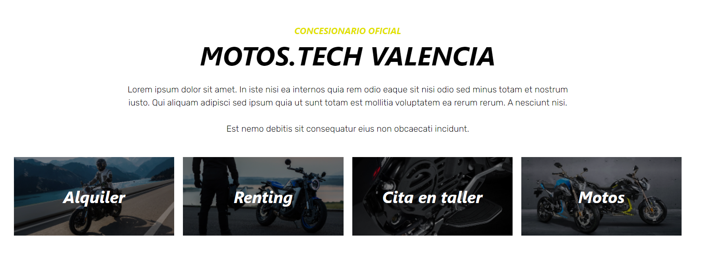

# Ydevs | Prueba técnica

¡Bienvenido/a a mi prueba técnica! Esta aplicación web, desarrollada con React, Tailwind CSS y Swiper, te permite explorar una variedad de motos y conocer los servicios ofrecidos.

## Funcionalidades Destacadas

- **Hero Slider:** Muestra imágenes atractivas de motos en un slider dinámico.
- **Catálogo de Productos:** Explora una selección de motos utilizando un slider intuitivo.
- **Servicios:** Descubre los servicios especializados que se ofrecen en la tienda.

## Tecnologías Utilizadas

- [React](https://reactjs.org/): Biblioteca de JavaScript para la construcción de interfaces de usuario.
- [Tailwind CSS](https://tailwindcss.com/): Framework de estilos utilitarios para el diseño web.
- [Swiper](https://swiperjs.com/): Biblioteca para implementar sliders y carruseles de manera sencilla.
- [Vite](https://vitejs.dev/): Herramienta de desarrollo para aplicaciones web modernas con React.
- [Yarn](https://yarnpkg.com/): Gestor de paquetes para la gestión eficiente de dependencias.

## Guía de Instalación

1. Clona este repositorio: `git clone https://github.com/solvesweb/ydevs-prueba.git`
2. Ingresa al directorio del proyecto: `cd ydevs-prueba`
3. Instala las dependencias con Yarn: `yarn install`
4. Inicia la aplicación localmente: `yarn dev`

## Capturas de Pantalla

*El Hero de la página.*

*Catálogo de las diferentes motos disponibles.*

*Servicios ofrecidos.*

## Contribuciones

Cualquier mejora no dudes en comentarla.

## Licencia

Este proyecto está bajo la Licencia MIT.
